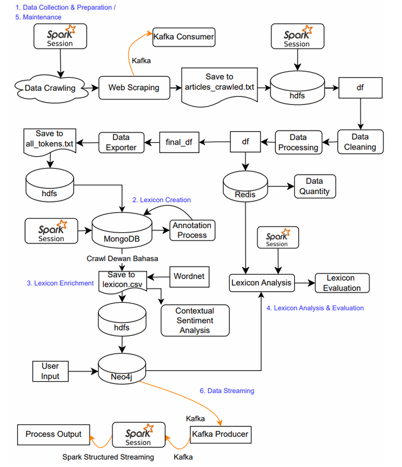
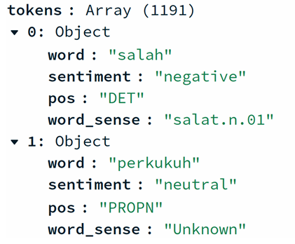
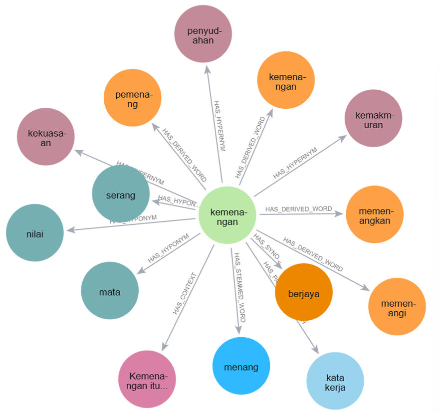
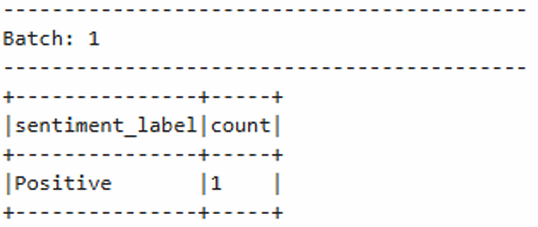
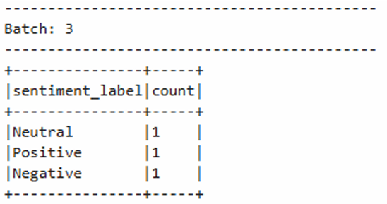
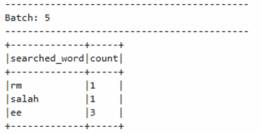
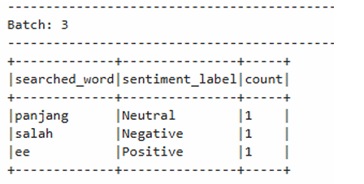

# Real-Time Data Engineering Pipeline for Malay News Analytics and Lexicon Enrichment

An end-to-end **real-time data engineering pipeline** for constructing and enriching a **Malay lexical knowledge base** from **Sinar Harian** sports news using **Apache Kafka**, **Apache Spark**, **Hadoop HDFS**, **MongoDB**, **Neo4j**, and **Redis**.

---

# 📖 Overview

This project develops a scalable framework for constructing and enriching a **Malay lexical knowledge base** from **Sinar Harian** sports news articles. It integrates **Apache Kafka, Apache Spark, Hadoop HDFS, MongoDB, Neo4j, Redis**, and **PRPM (Dewan Bahasa dan Pustaka)** to automate data collection, distributed preprocessing, lexicon construction, semantic enrichment, sentiment analysis, and real-time data streaming.

The pipeline provides:

- 🌐 Automated web scraping from **Sinar Harian**
- 📡 Real-time data streaming using **Apache Kafka**
- ⚡ Distributed text preprocessing with **Apache Spark**
- 📚 Automated lexicon construction using **MongoDB**
- 🔗 Lexicon enrichment using **PRPM (Dewan Bahasa dan Pustaka)** and **Malay WordNet**
- 🕸️ Graph-based semantic relationship modelling with **Neo4j**
- 😊 Sentiment analysis and linguistic annotation
- 📊 Lexicon analytics and evaluation using **Redis**
- 🔄 Incremental lexicon maintenance for newly collected articles

By combining modern Big Data technologies with Malay NLP resources, the proposed pipeline provides a scalable and efficient framework for building, enriching, maintaining, and analysing a Malay lexical knowledge base for future Natural Language Processing research and applications.

---

## 📑 Table of Contents

- [📖 Overview](#-overview)
- [✨ Features](#-features)
- [🏗️ System Architecture](#️-system-architecture)
- [🛠 Technology Stack](#-technology-stack)
- [📂 Project Structure](#-project-structure)
- [🚀 Workflow](#-workflow)
- [📊 Evaluation](#-evaluation)
- [📷 Results](#-results)
---
# ✨ Features

| Feature | Description |
|---------|-------------|
| 📰 **Data Collection** | Automatically crawls Malay sports articles from **Sinar Harian**, performs duplicate detection, and streams articles to Apache Kafka for real-time ingestion. |
| ⚡ **Distributed Data Processing** | Cleans and preprocesses articles using **Apache Spark** and **HDFS**, including tokenization, stopword removal, duplicate elimination, and English word filtering. |
| 📚 **Lexicon Construction** | Builds a Malay lexicon by storing processed tokens together with linguistic annotations such as stemmed words, POS tags, word sense, sentiment, and definitions in **MongoDB**. |
| 🔗 **Lexicon Enrichment** | Enriches the lexicon using **PRPM (DBP)** by retrieving definitions, synonyms, antonyms, hypernyms, hyponyms, meronyms, holonyms, and contextual examples. Semantic relationships are modeled in **Neo4j**. |
| 😊 **Sentiment Analysis** | Performs word-level and contextual sentiment analysis, generating sentiment scores and labels using Malay NLP models. |
| 📊 **Lexicon Analytics** | Produces descriptive analytics including lexicon size, POS distribution, word frequency, synonym network, word length, and sentiment distribution. Results are cached using **Redis** for efficient retrieval. |
| 📡 **Real-Time Streaming** | Utilizes **Spark Structured Streaming** and **Apache Kafka** to continuously process incoming articles, update the lexicon, and provide real-time dictionary search and word frequency analysis. |

---

# 🏗️ System Architecture

  

<em>Figure 1. System Architecture.</em>

The proposed architecture consists of six sequential stages, covering the complete workflow from data collection to real-time streaming. Apache Kafka enables data streaming between components, Apache Spark performs distributed data processing, MongoDB stores the generated lexicon, Neo4j models semantic relationships, Redis accelerates analytics, and Hadoop HDFS provides distributed storage throughout the pipeline.

| Step | Stage | Description |
|------|-------|-------------|
| **1** | 📰⚡ **Data Collection & Preparation** | Crawls Malay sports articles from **Sinar Harian**, streams the scraped articles through **Apache Kafka**, stores the crawled articles in `articles_crawled.txt` and **Hadoop HDFS**, then cleans and preprocesses the data using **Apache Spark**, including text cleaning, tokenization, duplicate removal, stopword filtering, and English word filtering. The processed tokens are exported as `all_tokens.txt` for downstream processing. |
| **2** | 📚 **Lexicon Creation** | Creates the initial Malay lexicon by importing processed tokens into **MongoDB**, where lexical entries are annotated with **Part-of-Speech (POS)** tags and **sentiment information**. |
| **3** | 🔗 **Lexicon Enrichment** | Enriches the lexicon using **PRPM (Dewan Bahasa dan Pustaka)** by retrieving definitions, stemmed words, synonyms, antonyms, derived words, hypernyms, hyponyms, meronyms, holonyms, and contextual information. The enriched lexicon is exported as a CSV file and imported into **Neo4j** for graph-based semantic analysis. |
| **4** | 📊 **Analysis & Evaluation** | Performs lexicon analysis using **Neo4j** and **Redis**, generating descriptive analytics and evaluating the lexicon through intrinsic and extrinsic evaluation metrics. |
| **5** | 🔄 **Lexicon Maintenance** | Performs incremental crawling by detecting previously collected articles, preventing duplicate entries, and updating the lexicon with newly collected data. |
| **6** | 📡 **Real-Time Streaming** | Integrates **Apache Kafka** and **Spark Structured Streaming** to enable real-time data streaming between pipeline components and support real-time lexicon updates and analytics. |

---

# 🛠 Technology Stack

| Category | Technology |
|-----------|------------|
| Programming Language | Python |
| Distributed Processing | Apache Spark (PySpark) |
| Stream Processing | Apache Kafka |
| Distributed Storage | Hadoop HDFS |
| Document Database | MongoDB |
| Graph Database | Neo4j |
| In-Memory Cache | Redis |
| NLP Libraries | NLTK, spaCy, Malaya |
| Web Scraping | BeautifulSoup |
| Deep Learning | HuggingFace Transformers |
| Data Manipulation | Pandas |
| Visualization | Matplotlib |

---
# 📂 Project Structure

| Folder | File | Purpose |
|--------|------|---------|
| **data_collection** | `data_collector.py` | Crawls and extracts Malay sports news from **Sinar Harian**. |
| | `kafka_client.py` | Streams scraped articles using Apache Kafka. |
| **preprocessing** | `data_cleaner.py` | Cleans and formats raw article text. |
| | `data_processor.py` | Tokenizes text and filters duplicate, stopword, and English words. |
| | `data_exporter.py` | Exports processed tokens from Spark to HDFS. |
| **lexicon** | `lexicon_creation.py` | Imports processed tokens into MongoDB and supports incremental updates. |
| | `annotation.py` | Annotates tokens with POS, sentiment, and word sense. |
| **enrichment** | `lexicon_scraper1.py` | Retrieves definitions, synonyms, antonyms, and derived words from PRPM. |
| | `lexicon_scraper2.py` | Retrieves semantic relationships from Malay WordNet. |
| | `sentiment_labelling.py` | Generates sentiment labels using a multilingual BERT model. |
| | `neo4j_connection.py` | Manages connections to the Neo4j database. |
| | `neo4j_importer.py` | Imports lexical entries and semantic relationships into Neo4j. |
| | `text_sentiment.py` | Performs contextual sentiment analysis on news articles. |
| **analysis** | `lexicon_size.py` | Calculates lexicon size and caches results in Redis. |
| | `accuracy_analysis.py` | Evaluates POS tagging accuracy. |
| **maintenance** | `new_data_collector.py` | Performs incremental crawling and lexicon updates. |
| **streaming** | `Task6.ipynb` | Demonstrates the real-time streaming pipeline. |
| **root** | `main.ipynb` | Executes the complete end-to-end pipeline. |

> **Note:** Python scripts (`.py`) implement the core pipeline modules, while Jupyter notebooks (`.ipynb`) demonstrate the complete workflow and evaluation.

---

# 🚀 Workflow

The pipeline executes the following workflow:

1. Crawl Malay sports articles from Sinar Harian.
2. Publish crawled articles to Apache Kafka.
3. Consume streaming data using Spark Structured Streaming.
4. Store crawled articles in Hadoop HDFS and preprocess them using Apache Spark.
5. Tokenize and filter meaningful Malay words.
6. Store processed tokens in MongoDB.
7. Enrich lexical information using PRPM (DBP).
8. Construct semantic relationships in Neo4j.
9. Cache analytics using Redis.
10. Perform lexicon evaluation.
11. Support real-time lexicon updates and streaming analytics.
---

# 📊 Evaluation

The generated Malay lexicon is evaluated using both **intrinsic** and **extrinsic** evaluation methods.

| Evaluation Type | Metric | Description |
|-----------------|--------|-------------|
| **Intrinsic Evaluation** | POS Tagging Accuracy | Measures the correctness of Part-of-Speech (POS) annotations generated for Malay lexical entries. |
| | Linguistic Correctness | Evaluates the consistency and validity of lexical information such as definitions, semantic relationships, and grammatical annotations. |
| | Word Sense Consistency | Assesses whether the assigned word senses accurately represent the intended meanings of lexical entries. |
| **Extrinsic Evaluation** | Bigram Precision | Measures the proportion of correctly identified bigrams among all predicted bigrams. |
| | Bigram Recall | Measures the proportion of reference bigrams that are successfully identified by the generated lexicon. |
| | Bigram F1-Score | Computes the harmonic mean of Precision and Recall to evaluate the overall effectiveness of the generated lexicon. |

---

# 📷 Results

## 🗄️ MongoDB Lexicon Entries

The processed lexical entries are stored in **MongoDB**, where each document contains linguistic annotations including the word, Part-of-Speech (POS), sentiment label, and word sense.

  

<em>Figure 2. Sample MongoDB Document of a Malay Lexical Entry.</em>

---

## 🔗 Neo4j Semantic Knowledge Graph

The enriched lexical entries are represented as a **Neo4j knowledge graph**, illustrating semantic relationships such as synonyms, hypernyms, hyponyms, derived words, stemmed words, and contextual information.

  

<em>Figure 3. Sample Neo4j Knowledge Graph for the Malay Word <strong>"kemenangan"</strong>.</em>

---

## 📡 Spark Structured Streaming

Real-time analytics are performed using **Spark Structured Streaming**, enabling continuous processing and visualization of streaming lexical data.

  
  

  
  

<em>Figure 4. Real-time analytics generated using Spark Structured Streaming.</em>

